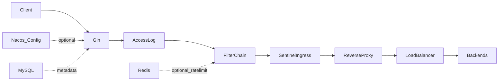

# Nexus

Nexus 是一个基于 **Go 1.21+**、**Gin** 的演示级 API 网关核心：静态/动态路由、可插拔过滤器链（JWT、内存/Redis 滑动窗口限流、访问日志）、**Nacos** 配置拉取与监听、**Sentinel** 入站 QPS 与出站慢调用熔断、**Redis** / **MySQL** 集成、后端 **健康检查** 与 **轮询/随机** 负载均衡，以及 **Admin HTTP API** 与 **Docker Compose** 一键依赖。

## 架构



中间件顺序：`Recovery` → 访问日志 → 过滤器链（RequestID → JWT → 限流）→ Sentinel 入站 → 业务路由；未匹配到 Admin/探活 的请求走 `NoRoute` 反向代理。

## 本地构建

```bash
go mod tidy
go build -o nexus ./cmd/nexus
```

默认读取 [`configs/routes.yaml`](configs/routes.yaml)。可先启动模拟后端（或可改为任意 HTTP 服务）：

```bash
# 示例：在另一终端于 18081 启动模拟后端
cd docker/mock-backend
set MOCK_ADDR=:18081
go mod tidy
go run .
```

启动网关：

```bash
set NEXUS_ROUTES_FILE=configs\routes.yaml
.\nexus
# GET http://localhost:8080/user/demo
# GET http://localhost:8080/health
# GET http://localhost:8080/admin/routes  （若设置 NEXUS_ADMIN_TOKEN 则需 Header: X-Admin-Token）
```

### 环境变量（摘要）

| 变量 | 含义 | 默认 |
|------|------|------|
| `NEXUS_ADDR` | 监听地址 | `:8080` |
| `NEXUS_ROUTES_FILE` | 本地路由 YAML 路径 | `configs/routes.yaml` |
| `NEXUS_ROUTES_SOURCE` | `file` 或 `nacos` | `file` |
| `NEXUS_JWT_SECRET` | JWT HS256 密钥 | `dev-secret-change-me` |
| `NEXUS_JWT_REQUIRED` | 是否强制 Bearer | `false` |
| `NEXUS_JWT_SKIP_PREFIXES` | 跳过 JWT 的前缀 | `/admin,/health` |
| `NEXUS_RATELIMIT_ENABLE` / `RPS` / `WINDOW_SEC` | 滑动窗口限流 | `true` / `100` / `10` |
| `NEXUS_REDIS_ADDR` | Redis（可选） | 空 |
| `NEXUS_REDIS_RATELIMIT` | 使用 Redis 限流 | `false` |
| `NEXUS_MYSQL_DSN` | GORM MySQL DSN（可选） | 空 |
| `NEXUS_SENTINEL_ENABLE` | Sentinel 开关 | `true` |
| `NEXUS_SENTINEL_FLOW_QPS` / `SLOW_RT_MS` / `SLOW_RATIO` | 流控与慢调用比例 | `5000` / `800` / `0.5` |
| `NEXUS_HEALTH_INTERVAL_SEC` / `HTTP_PATH` | 后端探测 | `10` / `/health` |
| `NEXUS_LB` | `round_robin` / `random` / `first` | `round_robin` |
| `NEXUS_ADMIN_TOKEN` | Admin 接口令牌（空则不校验） | 空 |
| `NACOS_SERVER_HOSTS` | 逗号分隔 `host:port` | `127.0.0.1:8848` |
| `NACOS_ROUTES_DATA_ID` / `GROUP` | 路由配置 DataId / Group | `nexus-routes.yaml` / `DEFAULT_GROUP` |

切换 **Nacos** 数据源时设置 `NEXUS_ROUTES_SOURCE=nacos`，并在 Nacos 控制台创建与 [`configs/routes.example.yaml`](configs/routes.example.yaml) 相同结构的 YAML（建议与本地文件一致，便于核对）。首次若在 Nacos 尚无配置，可暂时保留本地 `NEXUS_ROUTES_FILE`，进程会在订阅前尝试用该文件预热路由表。

## Docker Compose

```bash
docker compose up --build
```

- 网关：<http://localhost:8080>，路由文件挂载为 [`configs/routes.docker.yaml`](configs/routes.docker.yaml)（上游指向 `mock-backend`）。
- MySQL / Redis / Nacos / mock-backend 一并启动；`compose` 中 **nexus 默认仍使用 file 源**（Nacos 容器供进阶演示，可在环境变量中改为 `NEXUS_ROUTES_SOURCE=nacos` 并先在控制台发布配置）。

## 测试

```bash
go test ./...
```

## 路由 YAML 字段

- `id`：标识
- `path_prefix`：前缀匹配（如 `/user`）
- `strip_prefix`：转发前是否去掉此前缀
- `priority`：越大优先匹配（同优先级则更长前缀优先）
- `targets`：上游 URL 列表（支持负载均衡与健康检查过滤）

## 许可证

演示项目，按需在自有工程中调整安全与合规策略（JWT 密钥、Admin Token、Nacos/MySQL 凭据等）。
# Conflux
# Conflux
